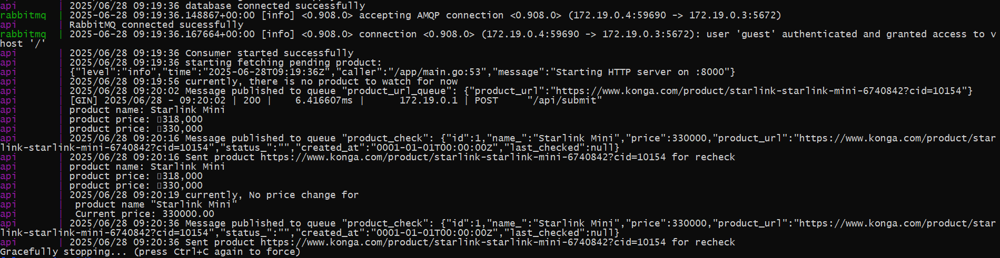

## alert-Me
Alert Me is a price drop alert system that tracks submitted E-commerce products and notify users when there is a reduction in the price. It relies on RabbitMQ for message exchange.

### How it works



The user submits a product URL, which is sent to a RabbitMQ queue. The system picks up this URL and processes it using the following services:

- **StartConsumer** which receives the submitted URL, scrapes the product’s name and current price, then saves the details to the database

- **SendForRecheck** periodicically fetches saved products details, and publishes them to a queue for price rechecking

- **ComparePrice** compares product prices and sends an alert if the price drops to a price_drop_alert queue and to the terminal

### Technologies Used

- Go (Gin) 
- Postgres
- RabbitMQ
- Docker and docker-compose

### Setup and installation

- Clone the repository:

```sh 
git clone https://github.com/Udehlee/alert-Me.git
```
```sh
cd alert-Me
 ```
- Install dependencies 
```sh
go mod tidy
```

- Create .env file and fill it with your credentials as shown in the .env.example
- In the  .env.example
```sh
 DOMAIN
 NAME_SELECTOR
 PRICE_SELECTOR
```
ensure the above carries the particular product you want to watch and recieve alert notification for.

- Start the application with
 ```sh
 docker-compose up --build
```
The sever is listening on http://localhost:8000

The rabbitMQ will be listening http://localhost:15672, login as:

 ```sh
name: guest
password: guest
```

 Starting the application will apply  the following migration files in the internals/db/migrations folder and create:

- a products table that will hold all the details of the scraped product_url

### Api Endpoints

```sh
POST /api/submit
```